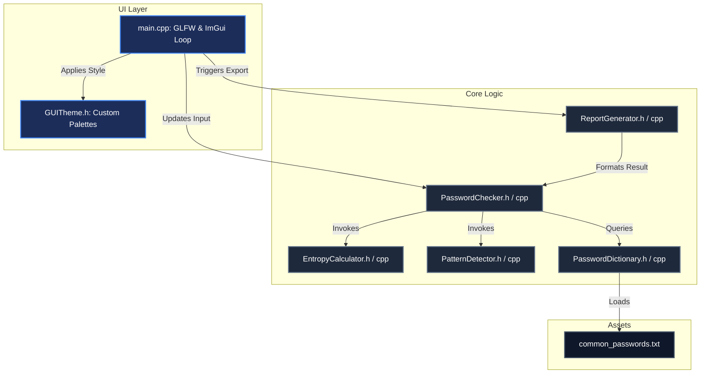

# Architecture & Technical Documentation

This document provides a detailed technical overview of the **Password Strength Checker** project structure, implementation details, data flow, mathematical models, and design patterns.

---

## 1. Architectural Overview

The application is structured as an offline desktop utility using a modular C++17 architecture, rendered via the **Dear ImGui** immediate-mode GUI framework on top of **GLFW** and **OpenGL 3.0**.

The code is divided into decoupled logic handlers and a single UI orchestration entry point.



---

## 2. Key Components & Class Reference

### `PasswordChecker::PasswordChecker`
The central orchestrator of the password evaluation pipeline. It combines metrics from the entropy calculator, pattern detector, and dictionary scanner to calculate a security score and list of recommendations.

- **`analyze(const std::string&, const PasswordDictionary&)`**: Runs a complete evaluation and returns an [`AnalysisResult`](#analysisresult-struct).
- **`estimateCrackTime(double entropy)`**: Estimates the time required to break the password under a high-performance offline brute-force attack.
- **`getStrengthLevelName(StrengthLevel)`**: Maps the strength enum to user-friendly strings.

### `PasswordChecker::EntropyCalculator`
Responsible for evaluating information entropy using information theory principles.

- **`calculateEntropy(const std::string&)`**: Computes the Shannon entropy of a password.
- **`calculatePoolSize(...)`**: Detects active character sets (lowercase, uppercase, numbers, symbols) and calculates the character pool size ($R$).

### `PasswordChecker::PatternDetector`
Implements pattern recognition algorithms to detect human-predictable weaknesses.

- **`hasRepeatedCharacters(const std::string&, std::string&)`**: Flags contiguous runs of identical characters (e.g., `aaaa`).
- **`hasSequentialNumbers(const std::string&, std::string&)`**: Detects ascending/descending digit sequences (e.g., `123`, `987`).
- **`hasSequentialAlphabets(const std::string&, std::string&)`**: Detects alphabetical runs (e.g., `abc`, `xyz`).
- **`hasKeyboardPatterns(const std::string&, std::string&)`**: Detects physical key slide runs on a QWERTY keyboard (e.g., `qwer`, `asdf`).

### `PasswordChecker::PasswordDictionary`
Loads and parses an offline file containing weak, leaked, or common dictionary words.

- **`loadFromFile(const std::string&)`**: Parses words, converts them to lowercase, and caches them in a fast hash set (`std::unordered_set`). It also populates a list sorted by word length (descending) to optimize substring matching.
- **`isCommonPassword(const std::string&)`**: Evaluates whether the entire password is present in the common list.
- **`containsDictionaryWord(const std::string&, std::string&)`**: Performs substring analysis to see if parts of the password contain dictionary terms.

### `PasswordChecker::ReportGenerator`
Exports the evaluation metrics into a portable, masked text file (`PasswordReport.txt`).

- **`generateTextReport(const AnalysisResult&)`**: Constructs the report text, masking characters of the input password for privacy.
- **`exportReportToFile(const std::string&, const AnalysisResult&)`**: Writes the generated string to the local disk.

### `PasswordChecker::GUITheme`
Encapsulates colors and layout properties for the ImGui graphics context.
- Provides static methods to apply either Slate Dark Mode or Clean Light Mode.

---

## 3. Cryptographic and Mathematical Formulations

### A. Shannon Entropy
Shannon Entropy ($E$) measures the cryptographic strength of a password by representing the number of bits of uncertainty.

$$E = L \times \log_2(R)$$

Where:
*   **$L$**: The length of the password string.
*   **$R$**: The size of the character pool (charset) based on active character types:

| Character Type | Example Set | Size Contribution |
|---|---|---|
| Lowercase | `a-z` | $26$ |
| Uppercase | `A-Z` | $26$ |
| Numbers | `0-9` | $10$ |
| Special Symbols | Standard printable punctuation & space | $33$ |

### B. Offline Crack Time Estimation
Estimating cracking time requires converting entropy into the time $T$ in seconds needed to test all possibilities.
*   **Attack Speed**: $10^{10}$ (10 billion) guesses per second, reflecting a high-performance offline graphics processing unit (GPU) cluster attack.
*   **Average Search Space**: On average, an attacker finds the password after checking half the keyspace: $2^{E-1}$.

To prevent floating-point overflow for exceptionally strong passwords (large $E$), the application calculates using base-10 logarithms:

$$\log_{10}(T) = (E - 1) \times \log_{10}(2) - \log_{10}(10^{10})$$

$$\log_{10}(T) = (E - 1) \times 0.30103 - 10.0$$

The result is scaled to human-readable units according to the following ranges:

*   $\log_{10}(T) < 0$: **Instant**
*   $\log_{10}(T) < 1.778$: **Seconds**
*   $\log_{10}(T) < 3.556$: **Minutes**
*   $\log_{10}(T) < 4.936$: **Hours**
*   $\log_{10}(T) < 6.413$: **Days**
*   $\log_{10}(T) < 7.498$: **Months**
*   $\log_{10}(T) < 9.498$: **Years**
*   $\log_{10}(T) < 11.498$: **Centuries**
*   $\log_{10}(T) \ge 11.498$: **Eternity**

---

## 4. Scoring Algorithm and Penalty System

The password score is calculated on a scale of **0 to 100**.

### 1. Base Score (Up to 60 Points)
Determined linearly by Shannon entropy, mapping up to 80 bits:

$$\text{Base Score} = \min\left(60.0, \frac{E}{80.0} \times 60.0\right)$$

### 2. Variety Bonus (Up to 40 Points)
*   **Lowercase Present**: $+10$ points
*   **Uppercase Present**: $+10$ points
*   **Digit Present**: $+10$ points
*   **Special Symbol Present**: $+10$ points

### 3. Penalties (Deducted from raw score)
*   **Length $< 8$ characters**: $-20$ points
*   **Contains Repeated character runs** (e.g., `aaa`): $-10$ points
*   **Contains Sequential numbers** (e.g., `123`): $-10$ points
*   **Contains Sequential letters** (e.g., `abc`): $-10$ points
*   **Contains Keyboard layout patterns** (e.g., `qwer`): $-10$ points
*   **Contains Dictionary word as substring**: $-25$ points

### 4. Overrides
*   If the password matches a known common password exactly, the final score is forced to **5** (Very Weak) regardless of its calculated raw score.
*   The final score is clamped to the range $[0, 100]$.

---

## 5. UI Architecture and State Loop

The user interface follows the **immediate-mode GUI paradigm**:
1. Every frame, GLFW polls input events.
2. ImGui starts a new frame context.
3. Code layout defines panels, inputs, and text.
4. Input fields are parsed in real time; if modified, the logic re-evaluates the password parameters instantly.
5. ImGui translates layout elements into vertex buffers.
6. The renderer (OpenGL 3.0) draws the frame onto the window context.

```
+-------------------------------------------------------------+
|                      main.cpp Main Loop                     |
+------------------------------+------------------------------+
                               |
                        [Poll Events]
                               |
                     [ImGui: Start New Frame]
                               |
                    +----------v----------+
                    |   Is Input Buffer   |
                    |      Modified?      |
                    +----+-----------+----+
                         |           |
                     Yes |           | No
                         v           v
           [PasswordChecker::analyze] [Render Layout]
                         |           |
                         +-----+-----+
                               |
                      [ImGui: Render Draw]
                               |
                     [GLFW: Swap Buffers]
                               |
            (Reloops until window should close)
```

---

## 6. How to Build and Run

To compile and link the application, run:

```bash
# 1. Generate CMake configuration files into the build folder
cmake -B build -S .

# 2. Build the project executable under Release configuration
cmake --build build --config Release

# 3. Run the executable from build output folder
./build/Release/PasswordStrengthChecker.exe
```

*Note: The C++ `FetchContent` framework fetches and builds GLFW and ImGui source files statically. No pre-installed package dependencies are needed, except for OpenGL drivers.*
